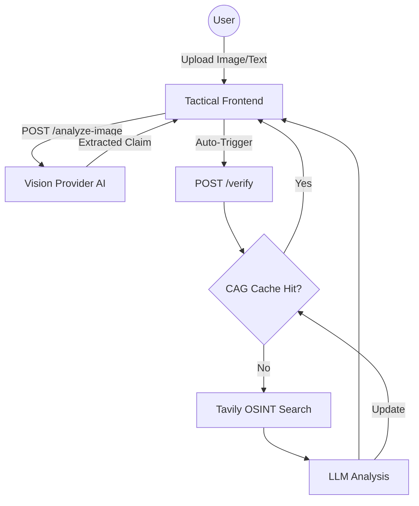

# ☠ WARWATCH — OSINT Misinformation Intelligence

**WarWatch** is a cutting-edge OSINT (Open Source Intelligence) tool designed to detect and analyze geopolitical misinformation and fake news in real-time. Built with a tactical military aesthetic, it provides users with a high-fidelity terminal interface to verify claims using AI and live web searches.

---

## 🏗 System Architecture



## 🛡 Features

- **Multimodal Intelligence**: 
    - **Image Extraction**: Integrated **GPT-4o-mini Vision** to extract factual claims from images (screenshots, social media posts).
    - **Auto-Verification**: Seamlessly triggers the verification pipeline once intelligence is extracted.
- **Real-Time Verification**: Connects to the **Tavily Search API** to cross-reference claims against credible global news sources.
- **CAG (Context-Augmented Generation) Cache**: Implements a high-performance semantic cache using **Qdrant Vector Database** to reduce latency and API costs for repeating queries.
- **Premium Tactical UI**: A futuristic military terminal design featuring brushed metal textures, scanlines, and glowing interactive elements.

## 🚀 Tech Stack

- **Backend**: FastAPI (Python)
- **AI/LLM**: OpenAI (GPT-4o-mini, Embeddings)
- **Search**: Tavily OSINT API
- **Database**: Qdrant Cloud (Vector Store)
- **Frontend**: Vanilla HTML5, CSS3 (Modern Glassmorphism), JavaScript (Async/Await)

## 🛠 Setup & Installation

1. **Clone the repository**:
   ```bash
   git clone <your-repo-url>
   cd osint-misinformation-agent
   ```

2. **Create a Virtual Environment**:
   ```bash
   python -m venv .venv
   source .venv/bin/activate  # On Windows: .venv\Scripts\activate
   ```

3. **Install Dependencies**:
   ```bash
   pip install -r requirements.txt
   ```

4. **Configure Environment Variables**:
   Create a `.env` file in the root directory:
   ```env
   OPENAI_API_KEY=your_openai_key
   TAVILY_API_KEY=your_tavily_key
   QDRANT_URL=your_qdrant_url
   QDRANT_API_KEY=your_qdrant_api_key
   ```

5. **Run the Application**:
   ```bash
   uvicorn main:app --reload
   ```

## 🌐 Deployment (Vercel)

This project is optimized for deployment on **Vercel**. 
1. Build and push your code to GitHub.
2. Link the repository to Vercel and add environment variables.
3. Deployment is automatic!

## ☠ Disclaimer
*Verdicts are AI-generated based on available online data. Always verify critical information independently.*
